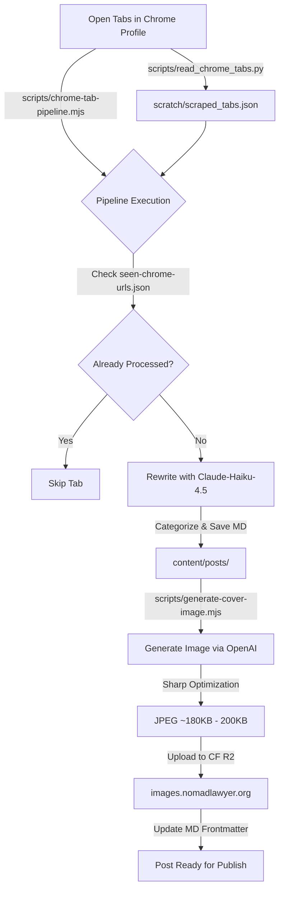

# 🚀 Automated Blog Publishing Pipeline Guide

This guide documents the end-to-end publishing pipeline used on **nomadlawyer.org** to automatically discover open article tabs in Google Chrome, scrape their contents, rewrite them into highly viral SEO-optimized posts, generate matching wide-angle AI cover images, and upload the results.

---

## 🛠️ System Architecture & Workflow

The pipeline consists of four main phases: **Tab Discovery & Scraping**, **Article Generation (LLM)**, **AI Image Generation & Optimization**, and **Deployment**.



---

## 📦 Key Files & Scripts Reference

| File / Script Path | Language | Purpose |
| :--- | :--- | :--- |
| [read_chrome_tabs.py](file:///Users/raushankumar/Working/Nomadlawyer/scripts/read_chrome_tabs.py) | Python + AppleScript | Focuses Chrome window, activates tabs matching target patterns, copy-scrapes rendered text to clipboard (`Cmd+A`, `Cmd+C`), and caches the content to prevent paywall/JS blocking. |
| [chrome-tab-pipeline.mjs](file:///Users/raushankumar/Working/Nomadlawyer/scripts/chrome-tab-pipeline.mjs) | JavaScript (Node) | Orchestrates the end-to-end pipeline: scans Chrome tabs, fetches article contents, calls Claude to rewrite, determines valid category, and updates the seen list. |
| [generate-cover-image.mjs](file:///Users/raushankumar/Working/Nomadlawyer/scripts/generate-cover-image.mjs) | JavaScript (Node) | Parses markdown frontmatter, generates visual prompts using Claude, calls OpenAI DALL-E, processes/compresses with Sharp, uploads to R2, and updates the markdown file. |
| [seen-chrome-urls.json](file:///Users/raushankumar/Working/Nomadlawyer/scripts/seen-chrome-urls.json) | JSON | Persistent list of all processed article URLs to avoid double-processing. |
| [scraped_tabs.json](file:///Users/raushankumar/Working/Nomadlawyer/scratch/scraped_tabs.json) | JSON | Local cache of scraped article text captured by clipboard automation. |
| `.env.local` / `.env` | Env Config | Contains `ANTHROPIC_API_KEY`, `OPENAI_API_KEY`, and Cloudflare R2 credentials (`CF_R2_ACCOUNT_ID`, `CF_R2_ACCESS_KEY_ID`, `CF_R2_SECRET_ACCESS_KEY`). |

---

## 1. Discovery & Scraping Phase

Some target news sites (e.g. Travel and Tour World) block standard HTTP requests or use heavy client-side Javascript. To bypass this, we utilize browser automation via macOS AppleScript.

### Step 1.1 — Run Tab Scraper
Bring the Google Chrome window belonging to the profile `ramekwal790@gmail.com` to the foreground (active on screen) and run:
```bash
python3 scripts/read_chrome_tabs.py
```
* **How it works:** The Python script queries open tab URLs. For matches containing `travelandtourworld.com/news/article/`, it activates Chrome, focuses the tab, performs a `Select All` (`Cmd+A`) and `Copy` (`Cmd+C`), reads the clipboard, and caches the content inside [scraped_tabs.json](file:///Users/raushankumar/Working/Nomadlawyer/scratch/scraped_tabs.json).

---

## 2. Generation & Writing Phase

The main orchestrator reads tab URLs and processes any unseen articles:
```bash
# Run dry-run to list tabs that will be processed
node scripts/chrome-tab-pipeline.mjs --dry-run

# Run actual pipeline
node scripts/chrome-tab-pipeline.mjs
```

### Models & Prompts
* **Model:** `claude-haiku-4-5-20251001` (fast, cost-effective, premium writing capabilities).
* **Tone & Formatting rules:** 
  * Factual, dramatic travel journalism layout with short, punchy paragraphs (2-4 sentences max).
  * Bold key entities and figures on first mention.
  * Use of Reddit-style quotes: `Reddit: *"Quote here."* — r/travel`
  * Strict avoidance of banned filler phrases (e.g., "delve into", "in conclusion", "all in all").
  * Automatic footer standard: Includes `## Related Travel Guides` (3 random links selected from existing post slug pool) and a topic-specific `**Disclaimer:**`.

### Target Blog Categories
Every article is assigned to one of these valid slugs and saved in `content/posts/[category]/[YYYY]/[MM]/[slug].md`:
* `airline-news` | `travel-news` | `tourism-news` | `hotel-news` | `cruise-news` | `railway-news` | `destination-news` | `travel-alert` | `travel-deals` | `travel-trends` | `travel-technology-news` | `travel-event-news` | `travel-association-news` | `meeting-and-event-industry-news` | `law-facts` | `travel-tips`

---

## 3. Image Generation & R2 Upload Phase

The pipeline automatically triggers `scripts/generate-cover-image.mjs` for each generated post. 

### Step 3.1 — Prompt Construction via Claude
Claude analyzes the post details and builds a prompt utilizing **Wide-Angle & Pulled-Back Composition Rules**:
* **Perspective:** Must use a wide-angle perspective (e.g., wide shot, medium-long shot, or full-body view) with the camera stepped back. The background environment (such as an airport terminal, hotel lobby, or street) must be clearly visible and occupy a substantial portion of the frame.
* **Depth of Field:** Moderate depth of field (ensuring background details remain recognizable and clear, not heavily blurred).
* **Copyright Safety:** Avoid trademarked names (e.g., Disney, Pokémon, Lufthansa) and replace them with high-quality generic descriptions (e.g., "famous theme-park characters", "sleek modern airplane boarding gate").

### Step 3.2 — DALL-E Execution & Optimization
1. The prompt is sent to OpenAI's `gpt-image-1.5` at `low` quality with size `1024x1024`.
2. The downloaded image is processed using **Sharp**:
   * Resized to `1300x900` pixels (covering center).
   * Iteratively compressed (target size: **180 KB - 200 KB**) for super-fast page loads.
3. The image is uploaded to the Cloudflare R2 bucket.
4. The markdown file's frontmatter is updated with the public URL: `https://images.nomadlawyer.org/images/blog/[category]/[year]/[month]/[slug].jpg`.

---

## 4. Manual / Individual Image Generation
To regenerate or generate a cover image for a single existing markdown file:
```bash
node scripts/generate-cover-image.mjs content/posts/[category]/[YYYY]/[MM]/[slug].md
```

---

## 5. Deployment & Verification

Always run a local build check to verify that Next.js compiles all new files without errors:
```bash
npm run build
```

Once verified, commit and push:
```bash
git add -A
git commit -m "Publish new batch of [N] articles"
git push
```
* Pushing triggers the automated CI/CD pipeline which deploys the static files to Hostinger. Check deployment status at: [GitHub Actions Runner](https://github.com/raushan790/Nomadlawyer/actions).
